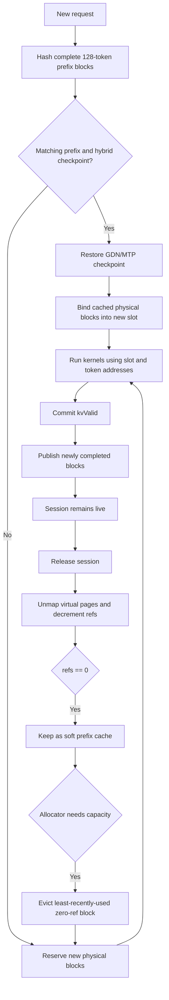

## Sparse buffers

KV execution uses one Metal placement-sparse buffer per K/V plane. Each 256 KiB virtual tile contains 128 token
positions for one plane. A live sequence's reusable slot selects a contiguous virtual range, so attention calculates
`slot * slot_stride + token`; Metal's MMU resolves the logical block to its physical heap tile.

A CPU-owned physical block is a bundle of 16 target tiles (K/V for eight full-attention layers), or 4 MiB. MTP GGUFs
add exactly two tiles for their one supported attention layer, making the bundle 4.5 MiB. All tiles in the bundle share
one physical ID, reference count, prefix hash, allocation, and eviction lifetime. Heaps are added only when the CPU
allocator issues new physical IDs.

Completed prefix blocks can map the same immutable heap tiles into several virtual ranges without copying data. These
aliases live within each plane's single sparse resource; a compute dispatch binds only the current K/V plane pair, so it
never binds conflicting sparse resources that alias the same tiles. Partial blocks remain private. Mapping updates are
ordered by a resource-state-to-dispatch barrier, and the serialized command path completes prior GPU work before
unmapping or reusing a tile.

MTP proposal KV is tentative until target verification. Verified target hidden states overwrite the persistent MTP
planes before `kv_valid` advances; hybrid GDN verification separately copies only the selected candidate column into
the inactive bank before publishing it with a bank flip.

Run target-only or speculative throughput with the same benchmark:

```bash
python benchmarks/benchmark_qwen35.py --decode 256 --iters 3
python benchmarks/benchmark_qwen35.py --speculative --decode 256 --iters 3
```

Two draft tokens are the default because this model's acceptance falls enough at larger depths to erase the saved target passes. The public limit remains four for workloads where the acceptance curve is better.

Target batches pack variable-length prompt, ordinary decode, and speculative verification queries behind one shared
`query_start_loc`. One scheduler rebuilds the execution batch after every target pass, so 128-token prompt chunks can
be rebatched with newly ready generation rows. Every target pass uses this packed layout; speculative rows derive their
candidate slices from it. All activation storage shares one reusable arena sized by packed target rows.

## Kernel profiling

Run the profiler to rank kernels inside the complete forward command buffer:

```bash
python benchmarks/profile_qwen35.py --prefill 128 --decode 32
```

Metal timestamps are GPU clock ticks, converted with the device timestamp frequency before reporting milliseconds. Precise timestamp markers add a small measurement overhead, so use the normal wall-clock benchmark for final latency numbers.


### Memory lifecycle
*Following is a mermaid diagram of the complete memory lifecycle*
