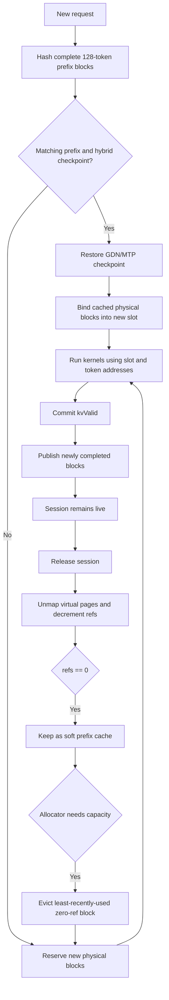

## Sparse buffers

KV execution uses two shared Metal placement-sparse buffers for target keys and values, plus one optional MTP buffer.
The target buffers each contain eight layer regions; the MTP buffer contains one K and one V region. Every region gives
each reusable sequence slot a `max_context`-sized virtual range. Attention binds the current layer's region view and
calculates `slot * slot_stride + token`; Metal's MMU resolves the logical block to its physical heap tile.

A CPU-owned physical block is a contiguous heap bundle laid out as `[K0..K7, V0..V7, MTP-K?, MTP-V?]`: 16 target
tiles (4 MiB), plus exactly two tiles for the single supported MTP layer when present (4.5 MiB total). Mapping one
logical block submits eight region updates to the target-key buffer, eight to the target-value buffer, and optionally
two to the MTP buffer. All tiles share one physical ID, reference count, prefix hash, allocation, and eviction lifetime.

Completed prefix blocks map the same immutable heap tiles into several slot ranges without copying data. Each alias of
a particular key or value tile remains within its corresponding shared sparse resource. Partial blocks remain private.
Mapping updates are ordered by a resource-state-to-dispatch barrier, and the serialized command path completes prior
GPU work before unmapping or reusing a bundle.

MTP proposal KV is tentative until target verification. Verified target hidden states overwrite the persistent MTP
regions before `kv_valid` advances; hybrid GDN verification separately copies only the selected candidate column into
the inactive bank before publishing it with a bank flip.

Run target-only or speculative throughput with the same benchmark:

```bash
python benchmarks/benchmark_qwen35.py --decode 256 --iters 3
python benchmarks/benchmark_qwen35.py --speculative --decode 256 --iters 3
```

Two draft tokens are the default because this model's acceptance falls enough at larger depths to erase the saved target passes. The public limit remains four for workloads where the acceptance curve is better.

Target batches pack variable-length prompt, ordinary decode, and speculative verification queries behind one shared
`query_start_loc`. One scheduler rebuilds the execution batch after every target pass, so 128-token prompt chunks can
be rebatched with newly ready generation rows. Every target pass uses this packed layout; speculative rows derive their
candidate slices from it. All activation storage shares one reusable arena sized by packed target rows.

## Kernel profiling

Run the profiler to rank kernels inside the complete forward command buffer:

```bash
python benchmarks/profile_qwen35.py --prefill 128 --decode 32
```

Metal timestamps are GPU clock ticks, converted with the device timestamp frequency before reporting milliseconds. Precise timestamp markers add a small measurement overhead, so use the normal wall-clock benchmark for final latency numbers.


### Memory lifecycle
*Following is a mermaid diagram of the complete memory lifecycle*

