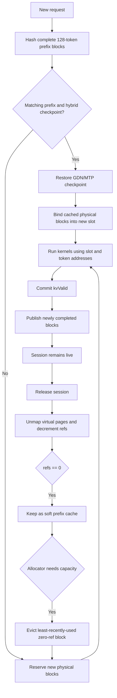

## State ownership

`runtime/inference.py` owns requests, `kv_valid`, phases, scheduling, and speculative acceptance. A native `Sequence` owns only its slot, sparse
bindings, and active GDN bank. `device.cpp` owns the shared block allocator, prefix table, hybrid checkpoints, and Metal mappings; `qwen_ops.cpp`
consumes a packed batch without owning session policy.

## Sparse buffers

KV execution uses separate shared Metal placement-sparse buffers for target K/V. MTP combines its single K and V region
in one drafter buffer; DFlash uses separate K/V buffers containing six layer regions each. At the 65,536-token maximum
context, a layer region spans 1 GiB across eight slots. This uses the minimum resources that fit: combining target K/V
would require 16 GiB, and combining all DFlash regions would require 12 GiB, both above this device's per-buffer limit.
Attention binds the current layer's region view and calculates `slot * slot_stride + token`; Metal's MMU resolves the
logical block to its physical heap tile.

A CPU-owned physical block is a contiguous heap bundle laid out as `[K0..K7, V0..V7, drafter K/V...]`: 16 target
tiles (4 MiB), plus two MTP tiles (4.5 MiB total) or twelve DFlash tiles (7 MiB total). Mapping one logical block submits
eight region updates to each target buffer, two to the MTP buffer, or six to each DFlash buffer. All tiles share one
physical ID, reference count, prefix hash, allocation, and eviction lifetime.

Completed prefix blocks map the same immutable heap tiles into several slot ranges without copying data. Each alias of
a particular key or value tile remains within its corresponding shared sparse resource. Partial blocks remain private.
Mapping updates are ordered by a resource-state-to-dispatch barrier, and the serialized command path completes prior
GPU work before unmapping or reusing a bundle.

Draft K/V beyond the accepted boundary is tentative until target verification; `kv_valid` is the sole visibility
cursor. Verified target hidden states overwrite the persistent drafter regions before `kv_valid` advances. Hybrid GDN
verification separately copies only the selected candidate column into the inactive bank before publishing it with a
bank flip. DFlash needs no seed or hybrid checkpoint beyond its token-addressed K/V.

Run target-only or speculative throughput with the same benchmark:

```bash
python benchmarks/benchmark_qwen35.py --weights weights/Qwen3.5-9B-UD-Q4_K_XL.gguf \
  --prompt-preset math --decode 256 --iters 3
python benchmarks/benchmark_qwen35.py --weights weights/Qwen3.5-9B-UD-Q4_K_XL-MTP.gguf \
  --drafter mtp --speculative --prompt-preset math --decode 256 --iters 3
python benchmarks/benchmark_qwen35.py --weights weights/Qwen3.5-9B-UD-Q4_K_XL.gguf \
  --drafter dflash --draft-weights weights/qwen35-9b-dflash-Q4_K_M.gguf \
  --speculative --prompt-preset math --decode 256 --iters 3
```

Models do not auto-detect a drafter. MTP defaults to two proposals and permits one to four. DFlash uses seven greedy
proposals; target sampling and verification remain authoritative. The DFlash path
loads the separate `Anbeeld/Qwen3.5-9B-DFlash-GGUF` Q4_K_M file and ignores embedded MTP tensors in the target.
The seven-proposal engine limit and eight-sequence batch limit derive the 64-row candidate arena because each
speculative row retains one anchor plus seven proposal snapshots across all target layers.
Use a chat-formatted preset or explicit token IDs for acceptance measurements; random vocabulary IDs remain useful for
kernel throughput but do not represent a distribution on which either drafter was trained.

Target batches pack variable-length prompt, ordinary decode, and speculative verification queries behind one shared
`query_start_loc`. One scheduler rebuilds the execution batch after every target pass, so 128-token prompt chunks can
be rebatched with newly ready generation rows. Every target pass uses this packed layout; speculative rows derive their
candidate slices from it. All activation storage shares one reusable arena sized by packed target rows.

## Kernel profiling

Run the profiler to rank kernels inside the complete forward command buffer:

```bash
python benchmarks/profile_qwen35.py --prefill 128 --decode 32
```

Metal timestamps are GPU clock ticks, converted with the device timestamp frequency before reporting milliseconds. Precise timestamp markers add a small measurement overhead, so use the normal wall-clock benchmark for final latency numbers.


### Memory lifecycle
*Following is a mermaid diagram of the complete memory lifecycle*

